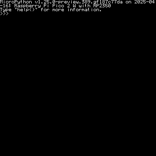
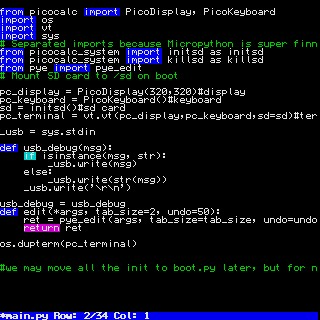
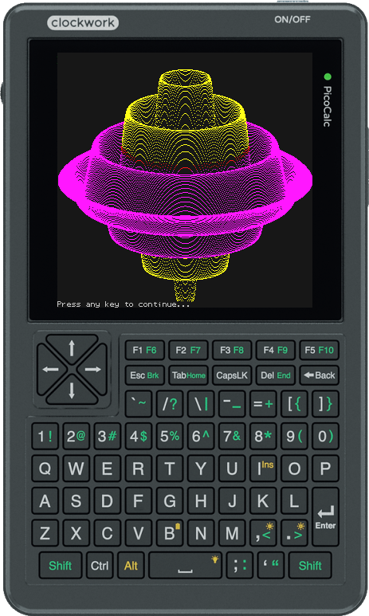

# MicroPython Drivers for PicoCalc

## Build Instructions

```
Folder structure:

|
|- micropython                      # Clone the MicroPython repo here
|   |- ports
|      |- rp2
|         |- build                 # Create this build folder
|         |- modules               # Place all py files from pico_files/modules/
|
|- PicoCalc-micropython-driver     # Driver modules
|   |- picocalcdisplay
|   |- vtterminal
|
|- Any additional modules (e.g., ulab, etc.)
```

Copy all files from pico_files/modules/ to micropython/ports/rp2/modules/ folder
Build MicroPython as usual, while including user modules:
```sh
cd micropython/ports/rp2
git submodule update --init --recursive
mkdir build && cd build
cmake .. \
  -DUSER_C_MODULES="Path/To/PicoCalc-micropython-driver/picocalcdisplay/micropython.cmake;Path/To/PicoCalc-micropython-driver/vtterminal/micropython.cmake" \
  -DMICROPY_BOARD=[TARGET_BOARD]
```

Supported `TARGET_BOARD` values:
- `RPI_PICO`
- `RPI_PICO2`
- `RPI_PICO2_W`

(Other boards are untested.)

---

## Installation
### With filesystem
The uf2 file already included file system and main.py, boot.py. Just flash it and remove the usb link to the pico module, tune on the picocalc.(The auto reboot seems to be broken, after copy finished, the usb driver won't disappear. That's ok, let me check how to fix it >_<>)
- **NO FILE COPY NEEDED!! The old file system will be destroyed!**

- picocalc_micropython_ulab_eigenmath_withfilesystem_pico2.uf2 (you could use it with your pico 2 or pico 2w module)
Included ulab, eigenmath port (https://github.com/zenodante/eigenmath_micropython), make picocalc a full function advanced calculator!
- picocalc_micropython_withfilesystem_pico.uf2 (for pico)
Only REPL, code editor 
- picocalc_micropython_withfilesystem_pico2.uf2 (for pico 2)
Only REPL, code editor 
- picocalc_micropython_withfilesystem_pico2w.uf2 (for pico 2w)
Only REPL, code editor 

### Without filesystem uf2
the filesystem in the pico module is safe, it won't be overwrite during your firmware upgrade.
- picocalc_micropython_NOfilesystem_pico.uf2
- picocalc_micropython_NOfilesystem_pico2.uf2
- picocalc_micropython_NOfilesystem_pico2w.uf2
- Flash the compiled `.uf2` to your Pico as usual.
- **Place only `main.py,boot.py` from pico_files/root/ in the pico root directory.**
- Copy '/examples/' to pico root (if you want)
- **Delete all existing `.py` files in `/lib`** (e.g., `fbconsole.py`, `picocalc.py`, etc.).  
  > These modules are already *frozen* into the firmware!

Using Thonny is the easiest method for file transfer and interaction.

If the flash nuke is needed, flash as normal, however **DO NOT UNPLUG** until the on-board light flashes to indicate it is done.
---

## Features

### ✅ Keyboard Driver  
Fully functional and tested. Works seamlessly with vt100 terminal emulator.

### ✅ ILI9488 Display Driver (C module + Python interface)  
- C module supports high-speed 1/2/4/8-bit LUT drawing and 16-bit 565RGB.  
- Python wrapper uses `framebuf` interface and handles display swapping.  
- Display updates now run on `core1` for a smoother REPL experience.

### ✅ screen capture
- Using ctrl + u to capture screen buffer into your sd card. currently only at the root of the sd card
The Data is in raw type. For default 16 color framebuff copy, it is 50kB each. Left pixel in high 4 bit.
Standard vt 100 16 color map may use to rebuild the image. I will upload a python script to convert it.

### ✅ Speaker Driver  
Enabled by LaikaSpaceDawg!


---

## Usage Notes

#### Working with WIFI on picoW/2W
The wifi chip connect to the rp2040/2350 via spi1, which shared with LCD. As we autorefresh the lcd on core1, it is necessary to stop the auto refresh function first via the function:
pc_terminal.stopRefresh(), after wifi finish its work, use pc_terminal.recoverRefresh() to recover the LCD refreshing.

### Internal code editor
You can launch the built-in Python code editor by calling:
```python
edit("abc.py")
```

Editor is based on [robert-hh/Micropython-Editor](https://github.com/robert-hh/Micropython-Editor)  
Now with keyword highlighting support.
### run examples
Copy examples folder under pico_files to your pico module root. 
Run it via command 
```python
run('/examples/rotation.py')
```



### Using eigenmath

I initialize Eigenmath early during system startup because it requires a contiguous 300kB block from the MicroPython heap. If we delay this allocation until later stages of the boot process, heap fragmentation may prevent us from obtaining such a large continuous memory region. Therefore, we allocate it at the beginning. So there is a special boot.py in root_eigenmath folder. If you are using the picocalc_micropython_ulab_eigenmath_withfilesystem_pico2.uf2, it is already included.
```python
#import eigenmath #not necessary, init in the boot
#em = eigenmath.EigenMath(300*1024) #the internal heap size, eigenmath needs A LOT OF RAM. It will be released after you delete the em instance
em.status() #show current resource status
em.run("d(sin(x),x)") #do math calculation, check the eigenmath manual for more details
em.reset() #reset the internal sources

#if you don't need it anymore
del builtins.em #del the eigenmath from root
gc.collect()
```

## color and screen frame buffer


### Accessing the Display

The screen is exposed via `picocalc.display`, which is an instance of the `PicoDisplay` class (a subclass of `framebuf`). You can use **all** standard `framebuf` methods to draw on it.

### VT100 Emulator Mode

- Runs in **4-bit color (16 colors)** mode to save limited RAM (≈50 KB).
- Uses an **internal color lookup table (LUT)** to map logical VT100 colors to the actual RGB565 values sent to the panel.

### Color Lookup Table (LUT)

- **Reset to the default VT100 palette**  
  ```python
  picocalc.display.resetLUT()
  ```
- **Switch to a predefined LUT**  
  ```python
  picocalc.display.switchPredefinedLUT("name")
  ```  
  Available presets: `"vt100"`, `"pico8"` (more coming soon).

### Inspecting and Modifying the LUT

- **Get the current LUT**  
  ```python
  lut = picocalc.display.getLUT()
  ```  
  Returns a 256-entry, big-endian 16-bit array you can read from or write to directly.

- **Note on color format**  
  - The display expects **RGB565** values.  
  - Because of SPI byte‐order, you must **swap high/low bytes** when writing back to the LUT.

- **Set a custom LUT**  
  ```python
  picocalc.display.setLUT(custom_array)
  ```  
  Accepts up to 256 16-bit elements to override the existing table.

> **Example usage:** see `examples/mandelbrot.py`.

### Core Usage & Refresh Modes

By default:

- **Core 0** runs the MicroPython VM.
- **Core 1** continuously performs color conversion and refreshes the screen in the background.

You can switch to **passive refresh mode**:

```python
#stop auto refresh
picocalc.display.stopRefresh()
# recover auto refresh
picocalc.display.recoverRefresh()
```

- In passive mode, the screen only updates when you explicitly call:
  ```python
  picocalc.display.show(core=1)
  ```
- The `show()` method takes a `core` argument (`0` or `1`) to choose which core handles color conversion and DMA ping‐pong buffer setup.
```


The REPL and editor both run inside a VT100 terminal emulator, based on  
[ht-deko/vt100_stm32](https://github.com/ht-deko/vt100_stm32), with bug fixes and additional features.

---

## Credits
- [robert-hh/Micropython-Editor](https://github.com/robert-hh/Micropython-Editor)  
- [ht-deko/vt100_stm32](https://github.com/ht-deko/vt100_stm32)
- `sdcard.py` is from the official MicroPython repository: [micropython-lib/sdcard.py](https://github.com/micropython/micropython-lib/blob/master/micropython/drivers/storage/sdcard/sdcard.py)
- `flash_nuke.uf2` is from the Raspberry Pi Documentation: [Resetting Flash Memory](https://www.raspberrypi.com/documentation/microcontrollers/pico-series.html#resetting-flash-memory)
